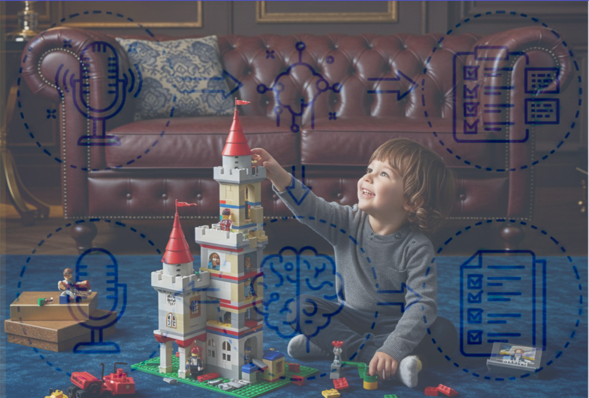

# TaskBuddy
### Intelligent Voice Memo Task Manager

<!-- Hero Image: Child Building Lego Castle with AI Flow Diagram Watermark -->

Welcome to **TaskBuddy**, a pioneering project demonstrating how modern architectural principles and intelligent AI can transform everyday productivity. This isn't just another task manager; it's a foundation for a personalized, adaptive assistant that understands and organizes your world the way *you* do.

### Vision: 
#### Reaching New Heights with Personalized Organization

Most applications impose rigid structures, forcing users into predefined categories that rarely align with their unique thought processes. TaskBuddy challenges this paradigm. Our vision is to create an intelligent system that:

* **Adapts to YOU:** Learns your personal language, tendencies, and implicit organizational patterns from your voice memos and task history.
* **Organizes Intuitively:** Compiles meaningful categorizations on the fly, moving beyond static tags to dynamic, AI-driven insights tailored to your life – whether you're a housewife or a deep-sea fisherman.

This project showcases the disciplined engineering required to build such an adaptable and intelligent system.

---

👉 [**Full Project Overview & Documentation**](notebooks/project.ipynb) 👈

---